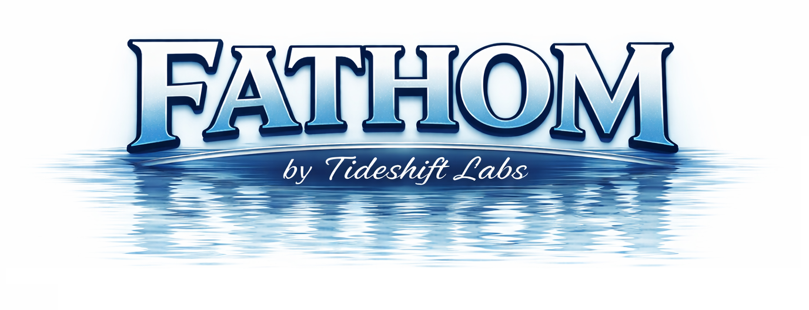
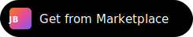

<p align="center">
  
</p>

[](https://www.unrealengine.com/)
[](https://www.jetbrains.com/rider/)

[](https://modelcontextprotocol.io/)
[](LICENSE)
[](https://plugins.jetbrains.com/plugin/30185)

<p align="center">
  <a href="https://plugins.jetbrains.com/plugin/30185">
    
  </a>
</p>

Fathom is a free, open-source plugin that helps AI coding assistants better understand your Unreal Engine 5 C++ projects. Whether you use Claude, Gemini, Codex, or any other LLM, Fathom gives them the right project context at the right time, reducing hallucinations and increasing your productivity.

## Why Fathom?

Unreal Engine projects are more than just C++ code. They include various binary files that are linked to the C++ code. Without understanding what's happening "in engine", LLMs working on UE5 C++ projects frequently hallucinate class names, miss Blueprint relationships, and produce code that doesn't match your project's actual structure. They can only see the files you feed them, and they have no way to query your project as a whole.

Fathom solves this by exposing your project's full picture through MCP tools that any compatible AI assistant can call on demand.

## What It Does

- **Solution-Wide Code Analysis**: Your LLM can query diagnostics and inspections for any file in the solution, not just the ones currently open.
- **Blueprint and Asset Discovery**: Find which Blueprints derive from a given C++ class, what they do and what their dependencies and referencers are.
- **Automatic Data Freshness**: Asset data is kept up to date so your LLM always works with the current state of the project.
- **MCP Tools**: Provides over 15 MCP tools to inspect various aspects as needed, using a UE5 plugin to query pertinent UE5 data.

## Philosophy

Fathom is not here to automate everything. It exists to reduce the friction of using LLMs with UE5, especially for C++ development. It intentionally does not provide Blueprint or uasset editing capabilities. Instead it focuses on helping your LLM agents better understand the full codebase, both C++ and Blueprints.

## Getting Started

Install the latest Fathom plugin from the [JetBrains Marketplace](https://plugins.jetbrains.com/plugin/com.tideshiftlabs.fathom) or manually by downloading it from the [GitHub releases page](https://github.com/Tideshift-Labs/Fathom/releases).

### Requirements

- **Rider** 2025.3+
- **Unreal Engine** 5.4+
- **Windows** 10 or 11. Other operating systems not yet supported.

### Companion UE Plugin

Blueprint and asset features require the [Fathom UE Link](https://github.com/Tideshift-Labs/Fathom-UnrealEngine) companion plugin. Fathom prompts you to install it and offers two locations: **Engine** (recommended, installs to `Engine/Plugins/Marketplace/`) or **Game** (installs to the project's `Plugins/` directory). Engine installation keeps your project clean and applies to all projects using that engine. The status bar widget shows the current installation status and location.

## Connecting Your AI Assistant

Fathom exposes an MCP endpoint at `http://localhost:19876/mcp` (streamable HTTP transport). The port defaults to `19876` and can be changed in Rider under **Settings > Tools > Fathom**.

Some tools are auto-configured on startup. If your tool was not configured automatically, follow the manual instructions below.

### Claude Code (CLI)

**Auto-configured.** Fathom writes `.mcp.json` in the solution root on every startup.

To verify, type `/mcp` in your Claude Code conversation. You should see `fathom` listed.

If it was not picked up, create or edit `.mcp.json` in your solution root:

```json
{
  "mcpServers": {
    "fathom": {
      "type": "http",
      "url": "http://localhost:19876/mcp"
    }
  }
}
```

### Cursor

**Auto-configured** when a `.cursor/` directory exists in the solution root.

To set up manually, create or edit `.cursor/mcp.json`:

```json
{
  "mcpServers": {
    "fathom": {
      "type": "http",
      "url": "http://localhost:19876/mcp"
    }
  }
}
```

### VS Code / GitHub Copilot

**Auto-configured** when a `.vscode/` directory exists in the solution root.

To set up manually, create or edit `.vscode/mcp.json`:

```json
{
  "servers": {
    "fathom": {
      "type": "http",
      "url": "http://localhost:19876/mcp"
    }
  }
}
```

### Codex CLI

Create or edit `.codex/config.toml` in your project root (or `~/.codex/config.toml` for global config):

```toml
[mcp_servers.fathom]
url = "http://localhost:19876/mcp"
```

Verify with:

```bash
codex mcp list
```

### Gemini CLI

Create or edit `.gemini/settings.json` in your project root (or `~/.gemini/settings.json` for global config):

```json
{
  "mcpServers": {
    "fathom": {
      "httpUrl": "http://localhost:19876/mcp"
    }
  }
}
```

### OpenCode

**Auto-configured** when an `opencode.json` already exists in the solution root.

To set up manually, create or edit `opencode.json` in your solution root:

```json
{
  "mcp": {
    "fathom": {
      "type": "remote",
      "url": "http://localhost:19876/mcp"
    }
  }
}
```

Verify with:

```bash
opencode mcp list
```

### Windsurf

Edit `%USERPROFILE%\.codeium\windsurf\mcp_config.json`:

```json
{
  "mcpServers": {
    "fathom": {
      "serverUrl": "http://localhost:19876/mcp"
    }
  }
}
```

### Claude Desktop

Claude Desktop does not support remote HTTP servers via its config file. Instead, add Fathom through the UI: **Settings > Connectors**, then enter `http://localhost:19876/mcp` as the server URL.

## Limitations

- Windows only
- Unreal Engine only (Unity support is planned)
- The UE companion plugin can be installed to the Engine (`Engine/Plugins/Marketplace/`) or the Game project (`Plugins/`)

## Documentation

- **[API Reference](docs/api_reference.md)**: Endpoint documentation with parameters, response formats, and status codes.
- **[Technical Overview](docs/technical_overview.md)**: Architecture and design decisions.
- **[Unreal Companion Doc](docs/ue-companion-plugin.md)**: Details on the UE companion plugin integration.
- **[Release Process](docs/release.md)**: Versioning, bump script, and release workflow.

### For Contributors

- **[Learnings & Troubleshooting](docs/LEARNINGS.md)**: Hard-won lessons and SDK quirks.
- **[SDK API Notes](docs/Resharper-SDK-API-Notes.md)**: API details for contributors.

## Building From Source

### First-Time Setup

Initialize the required build tools:

```powershell
powershell -ep Bypass -File .\scripts\setup.ps1
```

### Building and Running

```powershell
.\gradlew.bat :compileDotNet    # Compile the backend
.\gradlew.bat :runIde           # Launch sandbox with the plugin
```

Once running with your project open, verify the plugin is active:
```powershell
Invoke-RestMethod http://localhost:19876/health
```

## License

This project is licensed under the MIT License - see the [LICENSE](LICENSE) file for details.
